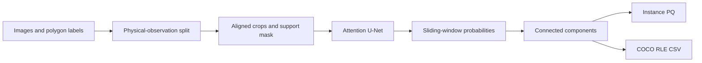

# Solar filament instance segmentation

[](https://github.com/ugurk-0/Solar-Filament-Segmentation-Challenge-2026/actions/workflows/tests.yml)

A PyTorch pipeline that identifies individual solar filaments in 2048 ? 2048 GONG H-alpha images. Built for the [Solar Filament Segmentation Challenge 2026](https://www.kaggle.com/competitions/filament-segmentation-2026), it covers training, instance extraction, Panoptic Quality (PQ) evaluation, and competition CSV export.

**Measured result:** mean local PQ increased from **0.0706 to 0.2632** across post-processing calibration and guided fine-tuning. This is an exploratory single-fold comparison on 85 observations, not a Kaggle score. The submission has been generated and checked locally; it has not been uploaded.


## Engineering highlights

- Group duplicate annotator records by physical observation to prevent split leakage; separate epoch monitoring, calibration, and assessment subsets.
- Evaluate instance PQ instead of relying on training loss. Reject follow-up runs when monitored PQ fails to improve.
- Train a ResNet-18 U-Net with attention gates, a residual dilated bottleneck, and BCE + Dice + clDice losses inside the annotation support.
- Keep one implementation behind CLI and notebooks, pinned dependencies, regression tests in CI, epoch previews, and validated COCO RLE exports.

## Results and decisions

All rows use the same 85-observation assessment subset and inference without TTA. Connected components use threshold 0.65 and minimum area 200, calibrated on 40 separate observations.

| Configuration | Mean PQ | Dataset PQ | TP | FP | FN |
|---|---:|---:|---:|---:|---:|
| Original checkpoint, watershed | 0.0706 | 0.0706 | 172 | 2,099 | 476 |
| Original checkpoint, calibrated components | 0.2073 | 0.2177 | 319 | 851 | 329 |
| Round 1, calibrated components | 0.2454 | 0.2511 | 322 | 671 | 326 |
| **Round 5, calibrated components** | **0.2632** | **0.2626** | 305 | 536 | 343 |

The largest improvement came from reducing fragmented instances through post-processing. Round 5 reduced the BCE positive-weight cap to 1.0 and the filament-centered crop probability to 50%; other crops are uniformly sampled and can still contain filaments. It reduced false positives while missing more true instances, yielding higher overall PQ.

Against the original calibrated checkpoint, Round 5 gained **0.0559 mean PQ**, with a paired observation-bootstrap 95% interval of **[0.0325, 0.0812]**. The assessment split was reused across rounds, so it is not an untouched final test. Intervals are conditional on one split and seed; architecture and loss contributions have not been isolated by ablation.

See the [experiment report](reports/pq_experiment_20260926.md) and [versioned metrics snapshot](reports/results_summary.json). Regenerate the figure with `python scripts/build_results_figure.py`.

## Pipeline



Training uses AMP, gradient accumulation, cosine scheduling, and EMA weights. Round 5 epoch 3 is selected. The local assessment uses no TTA; the exported CSV uses eight-way dihedral TTA. **The reported PQ does not measure the exact submitted inference configuration.**

## Quick start

Use Python 3.12 and a virtual environment. Install dependencies and run the synthetic regression suite (no dataset or trained weights required):

```bash
git clone https://github.com/ugurk-0/Solar-Filament-Segmentation-Challenge-2026.git
cd Solar-Filament-Segmentation-Challenge-2026
python -m pip install -r requirements.txt
python -m pytest tests -q
```

Download the competition data separately, then run a small execution check:

```bash
python solution.py train --fold 0 --epochs 2 --limit 8 --no-tta --data-dir MAGFiLO_1.0_Kaggle_2026/train --work-dir runs/smoke_fold0
```

This smoke test measures execution, not model quality. Full-resolution training benefits from a CUDA GPU. See [reproduction instructions](docs/REPRODUCING.md) for data layout, training, evaluation, checkpoint selection, and export.

**Reproducibility boundary:** datasets, trained checkpoints, and large run outputs are not bundled. Historical warm-start experiments require local checkpoints. A fresh clone can run tests and train from scratch, but cannot immediately recreate the reported CSV.

## Explore the implementation

| Entry point | Purpose |
|---|---|
| [solution.py](solution.py) | Model, training, metrics, inference, tuning, and export |
| [notebook.ipynb](notebook.ipynb) | Stages, epoch curves, and previews when local artifacts exist |
| [pq_experiment.py](pq_experiment.py) | Calibration and paired bootstrap comparisons |
| [tests/](tests/) | Metric edge cases, masks, TTA, training, and notebook export |
| [Kaggle guide](kaggle/README.md) | Portable notebook generation and upload |
| [Technical report](main.tex) | Method, measured results, and limitations |
| [Repository map](docs/REPOSITORY.md) | Supporting scripts and artifact locations |

Git strips large notebook outputs. The README figure and metrics snapshot provide a lightweight public record. The portable Kaggle notebook has been checked locally but has not been executed on Kaggle.

## Limitations

The annotation support uses an approximate longitude mask. Grouping removes duplicate-observation leakage but does not eliminate temporal correlation. Further work requires an untouched temporal holdout, multiple seeds/folds, and evaluation of the exact TTA submission configuration. There is no leaderboard or competition-winning claim.

Data originate from MAGFiLO and NSO/GONG; obtain them through the competition and follow its data terms. Data and trained weights are not redistributed here.
