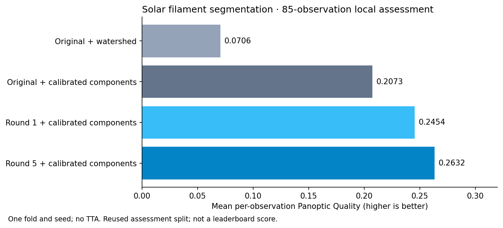
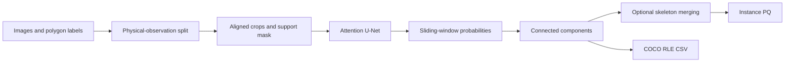

# Solar filament instance segmentation

Used Codex GPT 6 Astra to assist me in this work.

[](https://github.com/ugurk-0/Solar-Filament-Segmentation-Challenge-2026/actions/workflows/tests.yml)

A PyTorch pipeline that identifies individual solar filaments in 2048 × 2048 GONG H-alpha images. Built for the [Solar Filament Segmentation Challenge 2026](https://www.kaggle.com/competitions/filament-segmentation-2026), it covers training, instance extraction, Panoptic Quality (PQ) evaluation, and competition CSV export.

**Best retained research result:** **0.2891 mean PQ / 0.2878 pooled PQ**, using Round-5 U-Net probabilities and calibrated skeleton-endpoint merging. This is an exploratory comparison on 85 reused local observations, not a leaderboard score. The last user-reported Kaggle score is **0.24** for an earlier submission. See the [October 3 handoff](reports/handoff_20261003.md) and [merge experiment](reports/skeleton_merge_20261003.md).



## Engineering highlights

- Group duplicate annotator records by physical observation to prevent split leakage; separate epoch monitoring, calibration, and assessment subsets.
- Evaluate instance PQ instead of relying on training loss. Reject follow-up runs when monitored PQ fails to improve.
- Train a ResNet-18 U-Net with attention gates, a residual dilated bottleneck, and BCE + Dice + clDice losses inside the annotation support.
- Keep one implementation behind CLI and notebooks, pinned dependencies, regression tests in CI, epoch previews, and validated COCO RLE exports.

## Results and decisions

Methods below are grouped by the evidence available. Assessment values use the same 85-observation research subset, without TTA; monitoring/calibration and smoke values are explicitly labeled and are not comparable to assessment scores. No new leaderboard result is inferred from them.

| Method / process | Mean assessment PQ | Pooled assessment PQ | Result and evidence |
|---|---:|---:|---|
| Original checkpoint + distance watershed | 0.0706 | 0.0706 | Fragmented filaments; replaced |
| Original checkpoint + calibrated components | 0.2073 | 0.2177 | Large improvement from instance extraction |
| Round-1 guided fine-tuning | 0.2454 | 0.2511 | Improved over original calibrated model |
| Round-5 guided fine-tuning | 0.2632 | 0.2626 | Retained neural checkpoint; [training report](reports/pq_experiment_20260926.md) |
| Stricter confidence/size filtering, no closing | 0.2714 | 0.2710 | Retained components reference; [audit](reports/reference_notebook_review_20260927.md) |
| Less clDice, more Dice | 0.2736 | 0.2714 | Did not meet promotion gate; [batch report](reports/autoupgrade_20260928.md) |
| More random training crops | 0.2702 | 0.2650 | Rejected; same batch report |
| Annotation-medoid training | 0.2654 | 0.2629 | Rejected; [report](reports/annotation_medoid_20260929.md) |
| Inference windows 512/768/1024 | 0.2714 | 0.2710 | Existing 1024 configuration selected; [report](reports/window_context_20260929.md) |
| Instance-quality CNN filter | 0.2618 | 0.2694 | Lost too many correct detections; [method](docs/INSTANCE_QUALITY.md) |
| Confident-seed mask growth, six variants | — | — | Best calibration 0.2639 vs baseline 0.2700; no growth variant advanced; [report](docs/SEEDED_INSTANCES.md) |
| Radial illumination correction + fine-tuning | 0.2821 | 0.2707 | Mean gain uncertain, pooled PQ lower; not promoted; [research](docs/SOLAR_CV_RESEARCH.md) |
| Observation-balanced sampling + spine auxiliary loss | 0.2679 | 0.2680 | Selected spine arm rejected on assessment; control monitor 0.3217, spine monitor 0.3229; [report](reports/spine_learning_20261001.md) |
| CLAHE + short fine-tuning | — | — | Smoke-only training: monitoring 0.1823 vs raw 0.3138; no full run; [report](reports/clahe_20261002.md) |
| Instance-embedding head | — | — | Smoke execution only; no full assessment; [runner](experiment_instance_embeddings.py) |
| **Skeleton-endpoint merging** | **0.2891** | **0.2878** | **Promoted research candidate**; [report](reports/skeleton_merge_20261003.md) |
| YOLO11n instance segmentation | Pending | Pending | Training; [live report](reports/yolo11n_20261003.md), [method and reproduction](docs/YOLO_EXPERIMENT.md) |
| YOLO instances + retained U-Net boundaries | Pending | Pending | Calibration-gated refinement, no additional training; [method](docs/YOLO_EXPERIMENT.md#optional-refinement-without-more-training) |

Skeleton merging used endpoint distance at most 50 pixels, direction cosine at least 0.8, and mean gap probability at least 0.3, selected on 40 calibration observations. It gained 0.0177 mean PQ over the components reference, with paired observation-bootstrap 95% interval **[0.0061, 0.0310]**. Reuse of the assessment set limits the interpretation. The current regression suite passes 64 tests, including the optional YOLO checks in its separate environment. **PQ 0.60 remains a target.**

### Historical training comparison

These four historical rows use threshold 0.65 and minimum area 200, calibrated on 40 separate observations.

| Configuration | Mean PQ | Dataset PQ | TP | FP | FN |
|---|---:|---:|---:|---:|---:|
| Original checkpoint, watershed | 0.0706 | 0.0706 | 172 | 2,099 | 476 |
| Original checkpoint, calibrated components | 0.2073 | 0.2177 | 319 | 851 | 329 |
| Round 1, calibrated components | 0.2454 | 0.2511 | 322 | 671 | 326 |
| **Round 5, calibrated components** | **0.2632** | **0.2626** | 305 | 536 | 343 |

The largest improvement came from reducing fragmented instances through post-processing. Round 5 reduced the BCE positive-weight cap to 1.0 and the filament-centered crop probability to 50%; other crops are uniformly sampled and can still contain filaments. It reduced false positives while missing more true instances, yielding higher overall PQ.

Against the original calibrated checkpoint, Round 5 gained **0.0559 mean PQ**, with a paired observation-bootstrap 95% interval of **[0.0325, 0.0812]**. The assessment split was reused across rounds, so it is not an untouched final test. Intervals are conditional on one split and seed; architecture and loss contributions have not been isolated by ablation.

See the [experiment report](reports/pq_experiment_20260926.md) and [versioned metrics snapshot](reports/results_summary.json). Regenerate the figure with `python scripts/build_results_figure.py`.

The [automatic improvement report](reports/autoupgrade_20260928.md) records each subsequent hypothesis, configuration, epoch result, and keep/reject decision. `python autoupgrade.py` runs the current controlled batch after `python refine_postprocessing.py` completes. It preserves prior runs, validates exports, and screens candidates on fixed monitoring observations before further assessment.

## Pipeline



Training uses AMP, gradient accumulation, cosine scheduling, and EMA weights. Round 5 epoch 3 is selected. The original submission used eight-way dihedral TTA, unlike its local assessment. The later candidate in `runs/pq_refinement_20260928_fixed/submission.csv` uses no TTA, matching its local assessment configuration. **Local PQ is not a Kaggle leaderboard score.**

## Quick start

Use Python 3.12 and a virtual environment. Install dependencies and run the synthetic regression suite (no dataset or trained weights required):

```bash
git clone https://github.com/ugurk-0/Solar-Filament-Segmentation-Challenge-2026.git
cd Solar-Filament-Segmentation-Challenge-2026
python -m pip install -r requirements.txt
python -m pytest tests -q
```

Download the competition data separately, then run a small execution check:

```bash
python solution.py train --fold 0 --epochs 2 --limit 8 --no-tta --data-dir MAGFiLO_1.0_Kaggle_2026/train --work-dir runs/smoke_fold0
```

This smoke test measures execution, not model quality. Full-resolution training benefits from a CUDA GPU. See [reproduction instructions](docs/REPRODUCING.md) for data layout, training, evaluation, checkpoint selection, and export.

**Reproducibility boundary:** datasets, trained checkpoints, and large run outputs are not bundled. Historical warm-start experiments require local checkpoints. A fresh clone can run tests and train from scratch, but cannot immediately recreate the reported CSV.

## Explore the implementation

The [YOLO experiment guide](docs/YOLO_EXPERIMENT.md) explains pretrained instance segmentation, solar-support loss masking, GPU memory management, and PQ-based model selection. It uses a separate optional environment and leaves the existing submission pipeline available. The skeleton-merge research candidate has been assessed locally; its export integration is still pending.

The [instance-quality experiment](docs/INSTANCE_QUALITY.md) adds a learned
second-stage filter to the existing U-Net. It tests whether instance-level
quality prediction improves PQ beyond pixel-probability thresholds; production
defaults remain unchanged until a candidate passes paired assessment.

Read [how the pipeline produces the submission CSV](docs/PIPELINE_AND_CSV.md)
for a technical walkthrough, an explanation of the instance IDs and COCO RLE
strings, and a command to decode and audit a real export.

| Entry point | Purpose |
|---|---|
| [solution.py](solution.py) | Model, training, metrics, inference, tuning, and export |
| [notebook.ipynb](notebook.ipynb) | Stages, epoch curves, and previews when local artifacts exist |
| [pq_experiment.py](pq_experiment.py) | Calibration and paired bootstrap comparisons |
| [tests/](tests/) | Metric edge cases, masks, TTA, training, and notebook export |
| [Kaggle guide](kaggle/README.md) | Portable notebook generation and upload |
| [Technical report](main.tex) | Method, measured results, and limitations |
| [Repository map](docs/REPOSITORY.md) | Supporting scripts and artifact locations |

Git strips large notebook outputs. The README figure and metrics snapshot provide a lightweight public record. The portable Kaggle notebook has been checked locally but has not been executed on Kaggle.

## Limitations

The annotation support uses an approximate longitude mask. Grouping removes duplicate-observation leakage but does not eliminate temporal correlation. Further work requires an untouched temporal holdout, multiple seeds/folds, and evaluation of the exact TTA submission configuration. The 0.24 competition baseline is user-reported; the new candidate has no measured Kaggle score.

Data originate from MAGFiLO and NSO/GONG; obtain them through the competition and follow its data terms. Data and trained weights are not redistributed here.
