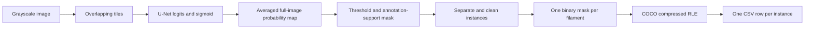

# From a solar image to a submission row

The main implementation is [solution.py](../solution.py). The network predicts
foreground pixels; post-processing turns them into separate filament instances.
The exporter encodes each instance mask into one CSV row.



## Learning the foreground

`get_fold` groups records by the physical observation name, not the annotation
ID. This prevents two annotators' versions of the same image from entering both
training and validation. Validation keeps one annotation set per observation.

`FilamentDataset` loads the grayscale image and rasterizes polygon annotations.
Training uses crops, including crops centred on positive filament pixels.
Geometric transformations keep images and targets aligned. A projected longitude
mask restricts supervision to the annotated part of the solar disk.

`FilamentUNet` uses a ResNet-18 encoder to produce features at several spatial
scales. The decoder upsamples those features and combines them with encoder
features through attention-gated skip connections. The dilated bottleneck adds
context. The segmentation head produces one logit per pixel. An auxiliary spine
head exists, but its loss weight is zero in the selected configuration.

The loss combines binary cross-entropy (pixel classification), soft Dice
(foreground overlap), and soft clDice (connectivity). These are training
objectives; PQ is used to assess instance predictions. EMA maintains smoothed
model weights, which inference loads from the selected checkpoint.

## Inference and instance extraction

`predict_full` processes overlapping windows rather than requiring one large
forward pass. For a 2048×2048 image, a 1024-pixel window and 256-pixel overlap
produce starts at 0, 768, and 1024 on each axis: nine windows in total.
Sigmoid converts logits into foreground probabilities. Overlap regions are
averaged to produce a full-resolution map.

With TTA enabled, the code also predicts flipped/transposed versions, reverses
each transformation, and averages the aligned predictions. Multiple supplied
checkpoints are averaged too. The manifest determines what a particular export
actually used; the latest corrected candidate described below has TTA disabled.

`prob_to_instances` thresholds the probability map within the annotation-support
mask. Connected-component labeling groups foreground pixels into instances
(SciPy's default 2D connectivity connects horizontal/vertical neighbours).
Optional watershed can split connected foreground into multiple instances.
Cleanup fills small unoccupied holes and retains a connected piece, but must not
take pixels owned by another instance. Small instances are discarded.

For `runs/pq_refinement_20260928_fixed/submission.csv`, the saved configuration is:

| Setting | Value |
|---|---|
| Checkpoint | Round 5, fold-1 best EMA weights |
| TTA | Disabled |
| Instance method | Connected components |
| Foreground rule | Probability strictly greater than 0.80 |
| Minimum retained area | 500 pixels |
| Closing kernel | 1 (closing disabled) |

A threshold of 0.80 is a decision rule, not a claim of 80% accuracy. It and the
area cutoff were selected using calibration observations. The test set has no
labels available to establish this candidate's PQ.

## Why the CSV has these two columns

```text
filament_id,segmentation_rle
20110120105534Ch_1,<compressed mask for the first instance>
20110120105534Ch_2,<compressed mask for the second instance>
20110120105534Ch_3,<compressed mask for the third instance>
```

This is a schematic excerpt: the bracketed text explains the fields and is not
valid RLE. The actual file contains encoded strings.

`filament_id` is the image filename stem plus a one-based instance number. Thus
`20110120105534Ch_2` means the second exported instance from
`20110120105534Ch.jpeg`. The suffix is neither a class nor a tracking identity
across observations. Numbering restarts for each image.

`segmentation_rle` contains the binary mask of exactly that instance. It does
not store a bounding box, probability map, or a list of polygon vertices.
The same image contributes as many rows as it has retained instances. An image
with zero instances contributes no row; its zero count remains in the manifest.
The fixed image dimensions are supplied when decoding rather than repeated in
each CSV row. `index=False` avoids an extra pandas index column.

## Why the encoded strings look unusual

COCO RLE visits pixels in column-major order: down a column, then to the next
column. It represents alternating runs of background and foreground, beginning
with a background run. Conceptually, `0 0 1 1 1 0` becomes counts `[2, 3, 1]`.
COCO compresses the counts further into a variable-length character string.
Letters, punctuation, and backslashes are therefore expected. This is not the
space-separated start/length format used by some other competitions.

The implementation uses `np.asfortranarray` so that encoding has the required
column-major memory layout. Decoding recovers the exact binary pixels, with no
loss of geometry. String length depends on the mask's run structure, not model
confidence. Use a CSV parser and `pycocotools`; do not manually strip characters.
See the [official COCO mask API](https://github.com/cocodataset/cocoapi/blob/master/PythonAPI/pycocotools/mask.py)
and [encoding implementation](https://github.com/cocodataset/cocoapi/blob/master/common/maskApi.c).

To decode the first real row:

```python
import pandas as pd
from pycocotools import mask as maskutils

rows = pd.read_csv("runs/pq_refinement_20260928_fixed/submission.csv",
                   dtype=str, keep_default_na=False)
row = rows.iloc[0]
mask = maskutils.decode({
    "size": [2048, 2048],  # [height, width]
    "counts": row["segmentation_rle"].encode("ascii"),
})
print(row["filament_id"], mask.shape, int(mask.sum()))
```

## How predictions are scored

Masks let the evaluator measure overlap with ground-truth filament instances.
The local implementation greedily matches unmatched pairs at IoU ≥ 0.5.
Matched masks contribute their IoUs; unmatched predictions are false positives,
and unmatched ground-truth instances are false negatives:

```text
PQ = sum(IoU of matched pairs) / (TP + FP/2 + FN/2)
```

This explains why producing more rows is not automatically better. Splitting one
filament into several pieces can create false positives and missed matches;
merging separate filaments can create false negatives. The number of CSV rows
alone says nothing about model quality.

## Inspect a complete export

```bash
python scripts/inspect_submission.py --csv runs/pq_refinement_20260928_fixed/submission.csv --test-dir MAGFiLO_1.0_Kaggle_2026/test/test_images --manifest runs/pq_refinement_20260928_fixed/submission_manifest.json --output-dir runs/submission_explained_20260928
```

This checks the schema, unique/sequential IDs, image inventory, manifest counts,
nonempty masks, instance overlap, and exact RLE round trips. It writes an audit
JSON and a three-panel figure showing an image, all its instances, and the first
decoded CSV row. The audit checks serialization and consistency, not prediction
accuracy or acceptance by Kaggle's hidden evaluator.
